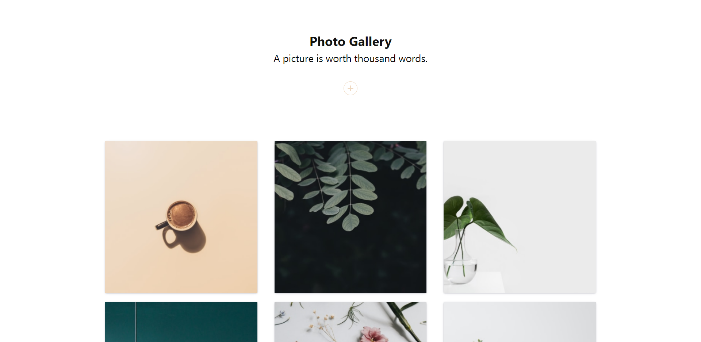
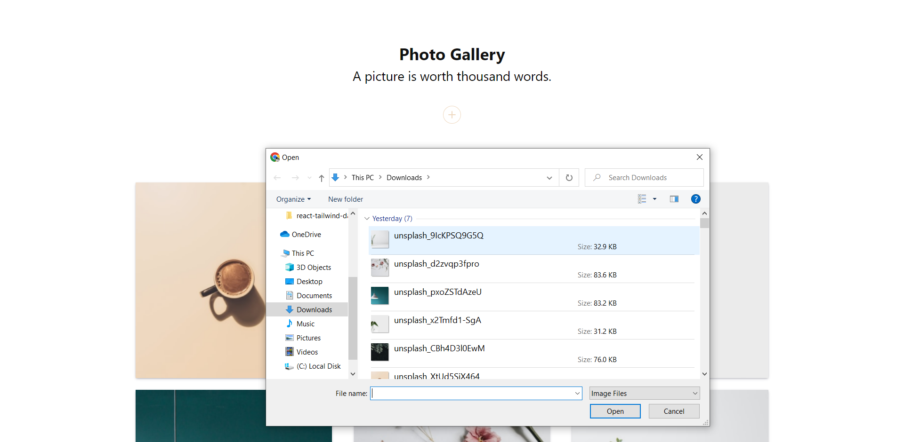
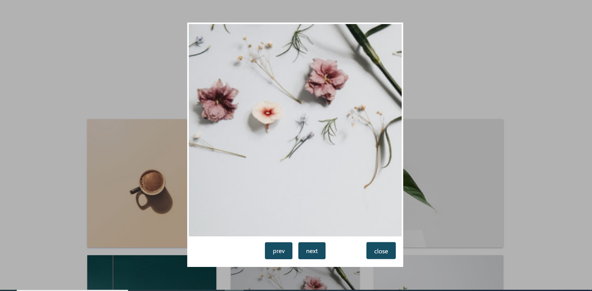

# MERN Gallery App

This is a web application that allows users to upload images, view them in a gallery, and also view individual images in a modal. The web app is fully responsive, adapting to different screen sizes.

# Screenshots

## Features

-   Image uploading: Users can upload their own images to the gallery.
-   Image gallery: Displays all uploaded images in a grid format.
-   Modal view: Allows users to click on an image in the gallery to view it in a modal.
-   Responsive design: The web app is designed to adapt to different screen sizes and devices.
-   Upload progress: Live image uploading progress can be seen

## Technologies used

-   React js
-   Tailwind css
-   Axios
-   react-toastify
-   Node js
-   Express js

## Installation

-   Clone git repository: "https://github.com/Cphasanulbanna/MERN-Image-Gallery/"
    => git clone "https://github.com/Cphasanulbanna/MERN-Image-Gallery/"
    => npm i
    => npm run dev
